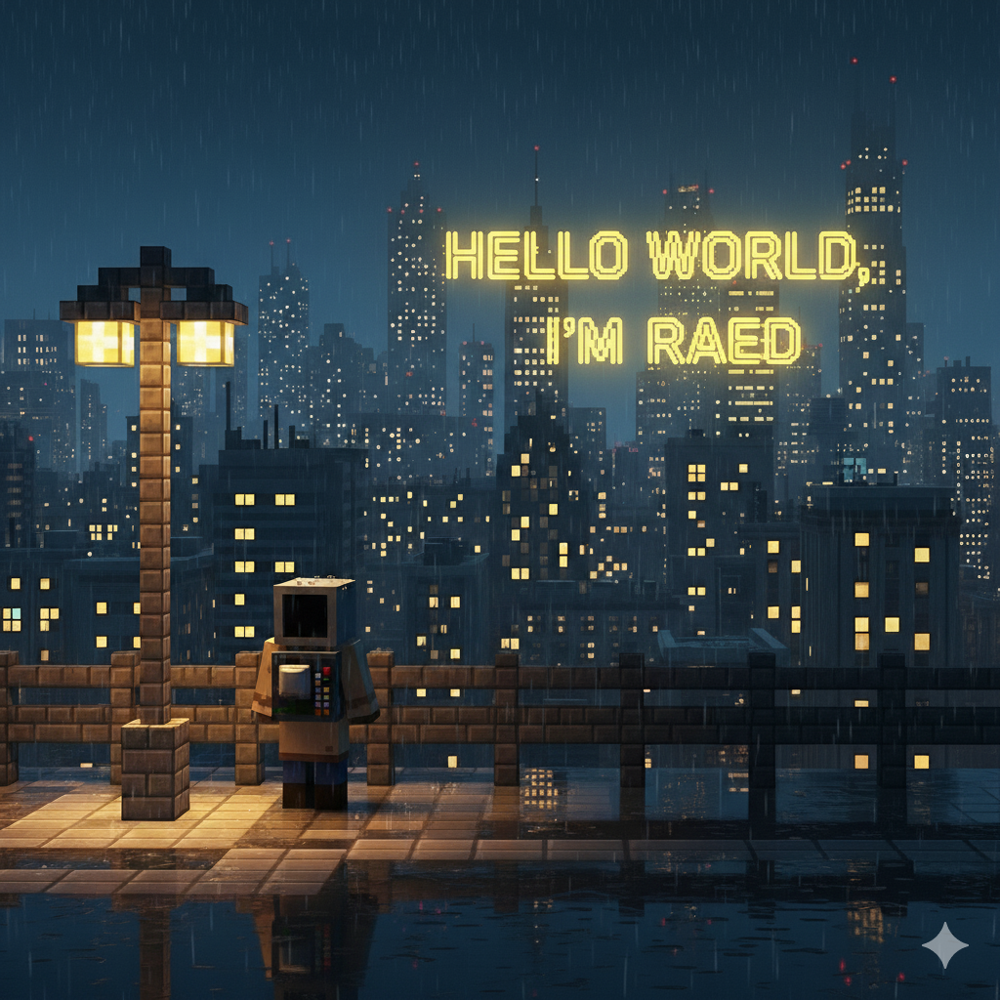

  

  
  

I am a Data Science and Artificial Intelligence Engineer 💻with expertise in DevOps and Linux 🐧, holding a Red Hat Certified System Administrator (RHCSA) certification ✅.
 As an Engineering student 🎓 at TEK-UP University, I have gained hands-on experience through internships 💼 at VMD, Progress Engineering, and ALL Circuits. I am proficient in languages like Python, SQL, and Java, and I am passionate about leveraging technology for innovative solutions ✨, with a strong interest in AI, machine learning, and entrepreneurship.
  
  

Technologies I master 🚀 :

 
 
<h3 align="center">🚨 PROJECT ACCESS AND CONTACT 🚨</h3>

    ALL MY PROJECTS ARE CURRENTLY IN PRIVATE MODE.  
    HOWEVER, I AM HAPPY TO GRANT ACCESS OR PROVIDE DEMONSTRATIONS UPON REQUEST.  
     
    PLEASE CONTACT ME DIRECTLY AT: <strong>RAEDBOUHALI@GMAIL.COM</strong>

 
<h3 align="center">Let's Connect & Collaborate! 🤝</h3>

  Interested in my work or want to see my private repositories?  
  Feel free to reach out, I'm always open to discussing Data Science, DevOps, or new ventures!

  

 
 
 
 

    <h3 style="margin-top: 0; color: #0366d6;">👨🏻‍💻👩🏻‍💻 Featured projects👨🏻‍💻👩🏻‍💻</h3>
    

        <b>
            ⛱️🛬 TUNISCO: A comprehensive tourism platform for exploring establishments in Tunisia ⛱️🛬
              
            🧙‍♂️🏰 Wizard World: A multimedia platform for films, books and games with user authentication 🧙‍♂️🏰
              
            🤖✨ Mars Chatbot: An intelligent conversational AI system with natural language processing 🤖✨
              
            💀😵 Hangman Game: A single-player word-guessing game with score tracking 💀😵
             
           📊📈 Design and development of a business opportunity management platform 📊📈

        </b>  
    

